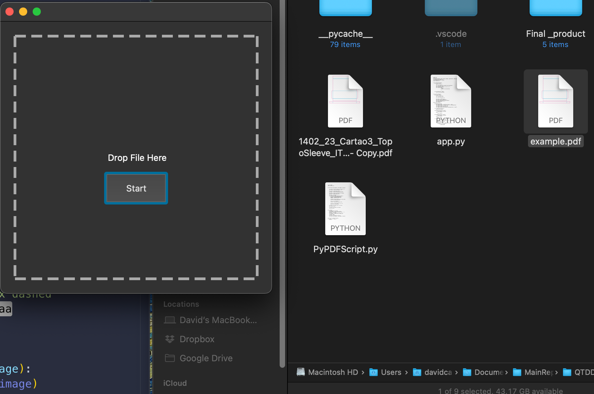
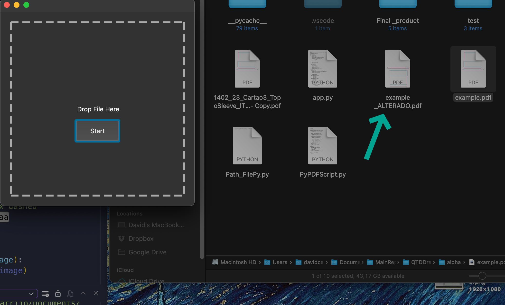

# QtEsko

### This project was made usining these modules :

> PyPDF2
> os
> QTPy5
>
> > AHK( AUTO HOT KEY)
> > pyautogui
> > pynput
> > time

## The use of this :

It make us take 1 to 3 seconds to format the pdf instead of 2 minutes(Open the program [Some pcs are slow it may take more] correct hte file and the save it again).

Late this year will try to post the results in a global scoope of how things are better than before.

##### The main file is the app.pyw, but as you see, you can just use the starter.ahk and use these shortcuts:

> CTRL+ALT+1 : For you to fix the PDF's
> CTRL+ALT+2 : For you to to the automatic action

### Now the break-down of what I learn :

--WIP--

# Some Imgs showing the result :

