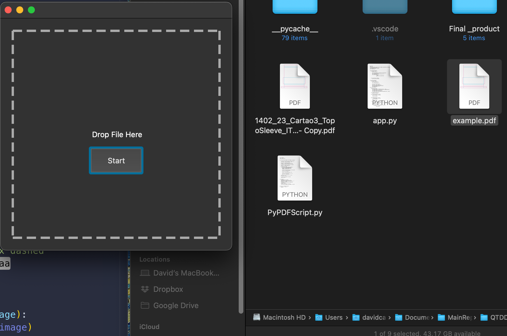
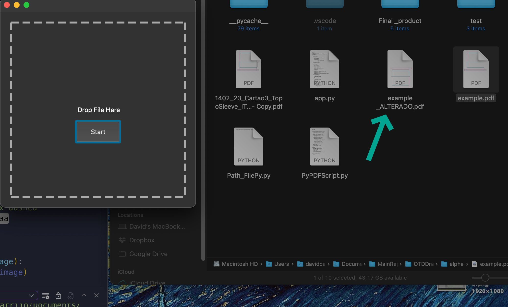

# QTDDragChangeFile.py

### This project was made usining these modules :
#### PyPDF2
#### os
#### QTPy5

### The use of this is:
To update some PDf on our bunisses DB(NAS), some of our workers have a outdated sofware and when they save it it messes with the file. 
This script come at my mind after some long months asking for them to change, so... I decided to be the change. 

It make us take 1 to 3 seconds to format the pdf instead of 2 minutes(Open the program [Some pcs are slow it may take more] correct hte file and the save it again).

Late this year will try to post the results in a global scoope of how things are better than before. 

## The main file is the app.pyw

### Now the break-down of what I learn :
--WIP--

#  Some Imgs showing the result :

